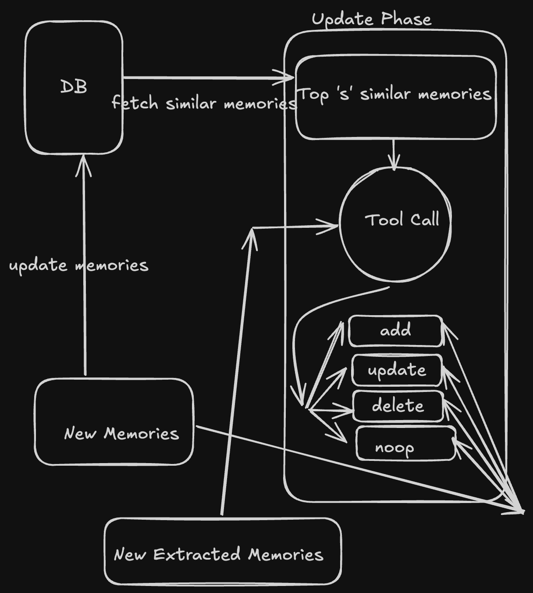

# memory

building our own memory system for our agent from scratch.

## why ?

LLMs can be thought of as stateless functions i.e given an chat
as a user input it can give an output, but the real strength is unlocked
when we pass it past conversations of our chat and results.

this is an exploration of how to do such a thing for an agent.

using DSPy and QDrant Vector database to explore that.

this also serves as an inspiration and understanding of how products like
[mem0](https://github.com/mem0ai/mem0) are built.

## how to ?

- How do we extract memories from conversations ?
- Store memories in external database for persistence
- selectively retrieve memories that are relevant to the current conversation
  - cannot dump all the information in the prompt
- keep memories up-to-date
  - keep indexing and searching to keep it relevant

## references

- [mem0 paper](https://arxiv.org/abs/2504.19413)

## architecture

1. For retrieving and keeping memories upto date

